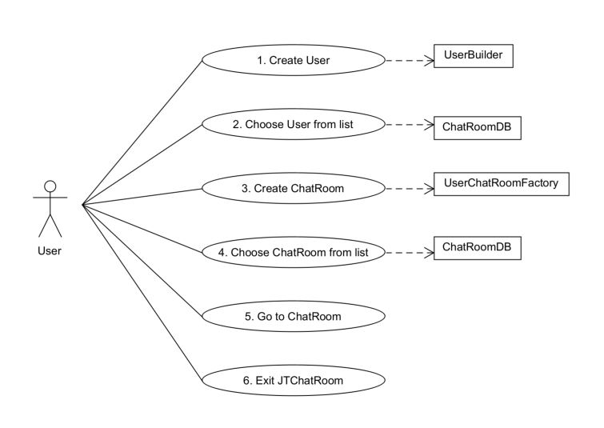
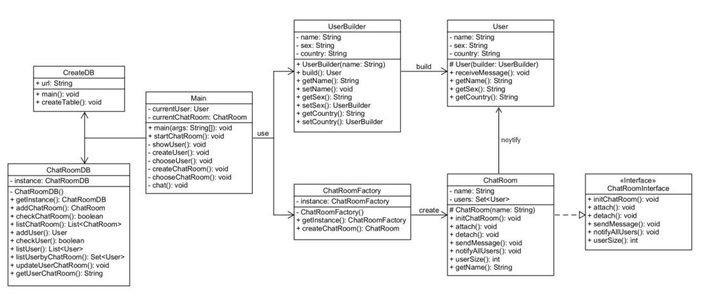

# Chatroom
-- CS665 Software Design and Patterns Final Project

Submitted: 04/28/2021

JTChatroom is a simulated chatroom platform that used four design patterns: Factory Method, Singleton, Builder, and Observer Patterns.

&nbsp;

## Design Goals

1.User: Create new user in database with input name, sex, and country, but only name is required. Choose created user from database.

2.Chatroom: Create new chatroom in database with input name. Choose created chatroom from database.

3.Chat: Current user can send messages to all users in current chatroom.

4.Main Menu: Show current user name, chatroom name, and the number of online users. Provide choice to create user, choose user, create chatroom, choose chatroom, go to chatroom, and exit program.

5.Database: Use SQLite to create the chatroom database.

6.I/O: Console I/O for program users, database I/O for program.

&nbsp;

## Assumptions

1.Initially create database with 5 users: UserA, UserB, UserC, UserD, UserE.

2.Initially create database with 3 chatrooms: ChatRoomA, ChatRoomB, ChatRoomC.

3.Initially attach UserA and UserB to ChatRoomA, UserC and UserD to ChatRoomC. UserE isn't attached to any chatroom.

&nbsp;

## Use Case Scenario



&nbsp;

## UML Class Diagram



&nbsp;


## Design Patterns

### Factory Method Pattern

#### Where

Factory: JTChatroom / edu.bu.met.cs665.model / ChatRoomFactory.java

Product Interface: JTChatroom / edu.bu.met.cs665.model / ChatRoomInterface.java

Product: JTChatroom / edu.bu.met.cs665.model / ChatRoom.java

#### Why

The class ChatRoom that extends ChatRoomInterface defines specific details of a ChatRoom. By using factory method pattern, ChatroomFactory allows clients to create new ChatRoom objects without having to know the details of how they're created, or what their dependencies are.

#### Flexibility

The separation of chatroom product and factory ensures to change chatroom characters and producing process independently. We can easily add, remove, modify any  methods in the class ChatRoom without affecting anything in the class ChatRoomFactory and vice versa. Besides, more concrete ChatRoom can be created easily by implementing the ChatRoomInterface. 

#### Simplicity & Understandability

The interface standardizes the ChatRoom objects. It is simple to understand the relationship of products and factory, so does the relationship of ChatRoom and ChatRoomFactory. 

&nbsp;


### Singleton Pattern

#### Where

Singleton_1: JTChatroom / edu.bu.met.cs665.model / ChatRoomFactory.java 

Singleton_2: JTChatroom / edu.bu.met.cs665.db / ChatRoomDB.java 

#### Why

Use singleton pattern to ensure the classes ChatRoomFactory and ChatRoomDB only has one instance and provide the method getInstance() as a global access.

#### Flexibility

Since the classes ChatRoomFactory and ChatRoomDB control their own instantiation process, these two classes have the flexibility to change the instantiation process and manage the number of instances.

#### Simplicity & Understandability

It is simple to understand that singleton object is always point to the same instance. Singleton provide a global access to prevent other objects from instantiating their own copies of the singleton object, ensuring that all objects access the single instance. 

&nbsp;


### Builder Pattern

#### Where

Builder: JTChatroom / edu.bu.met.cs665.model / UserBuilder.java

Product: JTChatroom / edu.bu.met.cs665.model / User.java

Director: JTChatroom / edu.bu.met.cs665 / createUser.java
          JTChatroom / edu.bu.met.cs665.db / CreateDB.java

#### Why

Use builder pattern to provide clear separation between the construction and representation of a User object, so that we can control the construction process and change the internal representation of User objects independently.

#### Flexibility

In reality, the User object can have much more characters and various complicated objects need to be created. Creating and assembling the parts of a complex object directly within a class is inflexible, because it commits the class to creating a particular representation of the complex object and makes it impossible to change the representation later independently from the class. The builder pattern provide a flexible solution to various complex objects creation, because of the separation of objects representation and construction. 

#### Simplicity & Understandability

Since the User object can be more complex, builder pattern increases the simplicity and clarity of its construction when there are many independent characteristic options that each have reasonable defaults. 

#### Security
Builder pattern delegates object creation to a Builder object instead of creating User objects directly, encapsulating creating and assembling the parts of user object in a separate Builder object.

&nbsp;


### Observer Pattern

#### Where

Subject: JTChatroom / edu.bu.met.cs665.model / ChatRoom.java

Object: JTChatroom / edu.bu.met.cs665.model / User.java

#### Why

Use observer pattern to implement sending message to all users. Considering all users in the same chatroom are observers, a user send a message means that the chatroom needs to notify all other users. This is a one-to-many dependency between ChatRoom and User objects. So when one user in current chatroom sends a message, all other users will receive message automatically. Besides, the methods attach() and detach() simulate that a user enter and exit a chatroom.

#### Flexibility

Observer pattern ensures to change the subject ChatRoom and observers Users independently. Users can be added, removed or modified without changing the ChatRoom or other Users.

#### Simplicity & Understandability

It is simple and clear to use sendMessage() in class ChatRoom and receiveMessage() in class User to notify all users in current chatroom. 

#### Avoid Duplicated Code

The subject ChatRoom can be reused without reusing its observers Users, and vice versa.

&nbsp;


## Run Instructions

Need to add sqlite-jdbc-3.34.0.jar to Maven Dependencies.

First run edu.bu.met.cs665.db / CreateDB.java to initially create the database.

Then run edu.bu.met.cs665 / Main.java to use JTChatroom.

&nbsp;


## The instructions from the README.md template

# Project Template

This is a Java Maven Project Template


# How to compile the project

We use Apache Maven to compile and run this project. 

You need to install Apache Maven (https://maven.apache.org/)  on your system. 

Type on the command line: 

```bash
mvn clean compile
```

# How to create a binary runnable package 


```bash
mvn clean compile assembly:single
```


# How to run

```bash
mvn -q clean compile exec:java -Dexec.executable="edu.bu.met.cs665.Main" -Dlog4j.configuration="file:log4j.properties"
```

We recommand the above command for running the Main Java executable. 


# Run all the unit test classes.


```bash
mvn clean compile test checkstyle:check  spotbugs:check
```

# Using Spotbugs to find bugs in your project 

To see bug detail using the Findbugs GUI, use the following command "mvn findbugs:gui"

Or you can create a XML report by using  


```bash
mvn spotbugs:gui 
```

or 


```bash
mvn spotbugs:spotbugs
```


```bash
mvn spotbugs:check 
```

check goal runs analysis like spotbugs goal, and make the build failed if it found any bugs. 


For more info see 
https://spotbugs.readthedocs.io/en/latest/maven.html


SpotBugs https://spotbugs.github.io/ is the spiritual successor of FindBugs.


# Run Checkstyle 

CheckStyle code styling configuration files are in config/ directory. Maven checkstyle plugin is set to use google code style. 
You can change it to other styles like sun checkstyle. 

To analyze this example using CheckStyle run 

```bash
mvn checkstyle:check
```

This will generate a report in XML format


```bash
target/checkstyle-checker.xml
target/checkstyle-result.xml
```

and the following command will generate a report in HTML format that you can open it using a Web browser. 

```bash
mvn checkstyle:checkstyle
```

```bash
target/site/checkstyle.html
```


